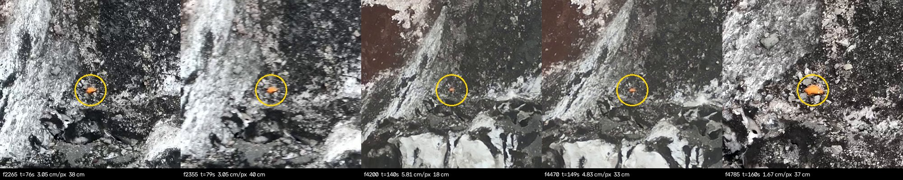

# Кандидат: оранжевый объект у крышки и палки

**Статус: КАНДИДАТ. Требуется перепроверка штабом перед выездом.**

Объект отсутствует в реестре `docs/nakhodki/`. Он попал в кадр многократно и определён
геометрически, но подтверждён только автоматически, глазами независимой группы. По правилу
из `AGENTS.md` любая находка перепроверяется до передачи в штаб, поэтому здесь приведены
все исходные данные, а не только координаты.

## Координаты

| | |
|---|---|
| широта | **39,483113 N** |
| долгота | **73,585457 E** |
| высота эллипсоидальная (WGS84) | **4534,8 м** |
| высота ортометрическая (EGM2008) | 4568,0 м |
| размер | **33–40 см** в поперечнике |
| цвет | насыщенный оранжевый на тёмной осыпи |

**Внимание к системе высот.** Эллипсоидальная и ортометрическая различаются здесь на
33,150 м. В реестре `docs/nakhodki/` высоты записаны эллипсоидальные (см.
[`README.md`](README.md)), поэтому для сравнения с рюкзаком, палкой и крышкой берите
строку «эллипсоидальная».

## Где это относительно известных находок

| от объекта | по горизонтали | по высоте |
|---|---|---|
| бирюзовая крышка | **3,6 м** | +4,0 м |
| треккинговая палка | 7,0 м | +5,5 м |
| рюкзак | 125 м | −128 м |

То есть объект принадлежит той же россыпи, что палка и крышка, и лежит чуть выше по
склону. Отдельным местом он не является.

## Как получены координаты

Пересечение пяти лучей от кадров реконструированного клипа
`DJI_20260813163855_0001_Z.MP4`. Цифровая модель рельефа **не использовалась**, поэтому
ошибка GLO-30 в этом месте (+23,7 м у крышки) в результат не входит.

| кадр | время | дальность | см/пкс | пиксель | пятно, пкс | размер | промах луча |
|---|---|---|---|---|---|---|---|
| 2265 | 76 с | 228,3 м | 3,05 | 380, 806 | 157 | 38 см | 0,014 м |
| 2355 | 79 с | 227,4 м | 3,05 | 662, 591 | 172 | 40 см | 0,017 м |
| 4200 | 140 с | 164,9 м | 5,81 | 959, 558 | 10 | 18 см | 0,018 м |
| 4470 | 149 с | 137,3 м | 4,83 | 959, 500 | 48 | 33 см | 0,016 м |
| 4785 | 160 с | 124,1 м | 1,67 | 901, 459 | 491 | 37 см | 0,018 м |

Максимальный базис между кадрами **113,5 м**, медианный промах лучей **0,017 м**.

**Как это читать.** 0,017 м — это внутренняя согласованность решения, а не абсолютная
точность. Абсолютная ограничена привязкой реконструкции: медианная невязка положений
камер 1,91 м, а на двух лазерных точках, не участвовавших в подгонке, реконструкция даёт
+3,3 м и +2,7 м по высоте. **Реалистичная оценка абсолютной ошибки — около 3 м**, с
систематическим завышением высоты.

Оценка 18 см на кадре 4200 получена по пятну в 10 пикселей и ненадёжна; четыре остальных
кадра согласованно дают 33–40 см.

## Кадры

Контактный лист со всеми пятью наблюдениями:



Отдельные вырезки 400×400: `kadry/oranzhevyy_f00XXXX.jpg`.

Объект хорошо виден и на двух кадрах с сильным зумом, по которым на него первоначально
обратили внимание:

- `kadry/kadr_003415.jpg` — t = 114 с, объект крупно, рядом слева бирюзовое пятнышко
  (предположительно та самая крышка);
- `kadry/kadr_013215.jpg` — t = 441 с, надирный ракурс.

Оба кадра привязаны только по телеметрии, а не реконструкцией, и в расчёт координат **не
входили**. Фокусные для них измерены отдельно, цепочкой масштабов SIFT от
реконструированного кадра: 65 984 пкс и 17 400 пкс. Обе величины выше оптического предела
M30T (14 315 пкс при 1920), потому что оператор работал с цифровым зумом поверх
оптического.

## Что стоит проверить штабу

1. Это снаряжение или камень/лишайник? Оранжевый на осыпи встречается редко, но не
   уникален. Контактный лист даёт пять независимых ракурсов.
2. Не тот ли это оранжевый предмет, что упоминается по вертолётной съёмке (C0044/C0045) и
   до сих пор не локализован? Здесь он локализован, если это он.
3. Сопоставить с уже зафиксированными жёлтыми и бирюзовыми откликами в
   `analysis/pilot/gt-results/detections.tsv`: часть из них отнесена к центру кадра по
   лазерной точке, а не к самому объекту, и их координаты поэтому приблизительные.

## Воспроизведение

```bash
python analysis/scene3d/build_scene3d.py
```

Координаты пересчитываются из кадров при каждой сборке и попадают в
`scene.json` → `verification.orange_object_triangulation`. Цифры в этом документе не
вписаны руками.
